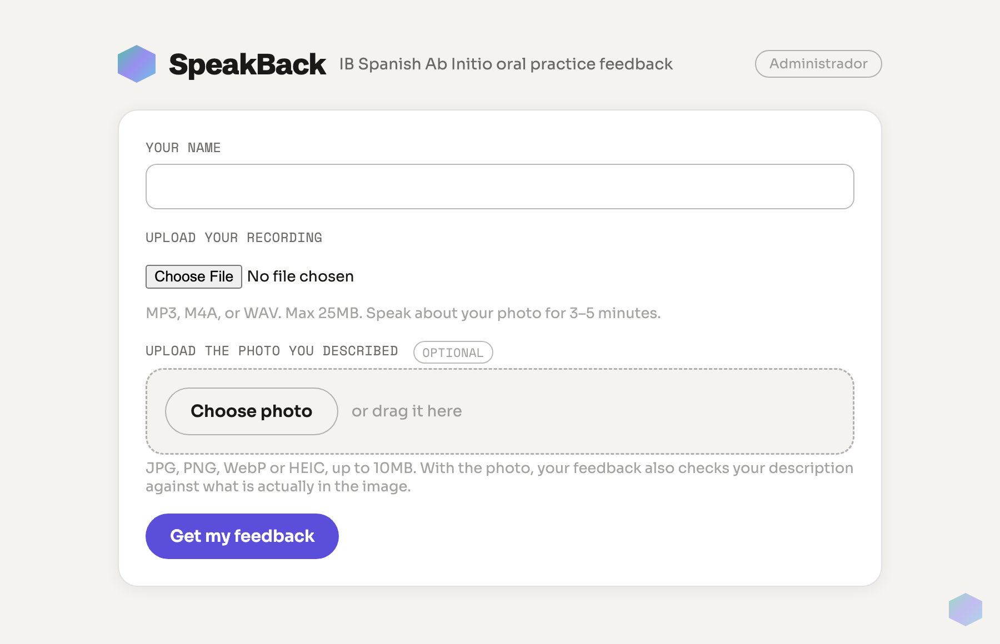

# SpeakBack

IB Spanish Ab Initio Individual Oral practice feedback — students upload a recording of
themselves describing a photo (the one-way first part of the oral, no examiner) plus, optionally,
the photo itself, and get back rubric-based feedback generated against a teacher-calibrated rubric.

**Live:** https://speakback.onrender.com



## How it works

1. A student enters their name, uploads an audio recording (MP3/M4A/WAV, up to 25MB) of
   themselves describing the photo, and optionally uploads the photo (JPG/PNG/WebP/HEIC, up to
   10MB).
2. If a photo was uploaded, Gemini first reads it on its own — what is visible, any legible text,
   cultural cues, what is ambiguous — so every later step judges against the same objective
   picture. The recording is then graded twice (once from the audio, once from a transcript) and a
   judge reconciles the two against `feedback.md`. Audio and photo only live in memory for the
   duration of the request; neither is ever written to disk.
3. The student gets back:
   - A full Spanish transcript of their spoken turns.
   - Strengths and successes, with specific examples.
   - Targeted corrections (error → why → correction).
   - Rubric-based scoring for Criterion A (/12) and B1 (/6), as a subtotal /18. Conversation
     (B2) and Interaction (C) are not assessed — there is no examiner on the recording — so no
     /30 total or IB grade is given.
   - Actionable, prioritized recommendations tied to their actual gaps.
   - A check for use of the taught phrase banks / "Describir la Foto" framework.
   - A **Download PDF** button that opens the browser's print dialog (choose "Save as PDF"); a
     compact print stylesheet keeps the result short and the text selectable.
4. Every submission (transcript + feedback) is saved to Postgres so teachers can review
   student history from an admin dashboard.

> This tool is for practice only — it does not represent or influence a student's official
> teacher-assigned grade.

## Stack

- **Server:** Node.js + Express, audio handled in-memory via Multer (never persisted to disk)
- **Grading:** Google Gemini (`@google/generative-ai`), audio input + structured JSON output
- **Database:** Neon serverless Postgres (HTTP driver, so it works on networks that block
  the raw Postgres port)
- **Frontend:** static HTML/CSS/JS in `public/`
- **Hosting:** Render

## Running locally

```bash
npm install
cp .env.example .env   # fill in GEMINI_API_KEY, DATABASE_URL, etc.
npm start
```

The app runs at `http://localhost:3000`. Admin dashboard is at `/admin`, gated by
`ADMIN_USER` / `ADMIN_PASSWORD` from `.env`.

### Environment variables

| Variable | Purpose |
|---|---|
| `GEMINI_API_KEY` | Google AI Studio API key |
| `GEMINI_MODEL` | Gemini model used for grading (must support audio input) |
| `ADMIN_USER` / `ADMIN_PASSWORD` | Login for `/admin` |
| `SESSION_SECRET` | Signs the admin session cookie |
| `FEEDBACK_MD_PATH` | Path to the grading rubric (read fresh on every request) |
| `DATABASE_URL` | Neon Postgres connection string |
| `PORT` | Server port (default 3000) |

## The rubric

`feedback.md` is the actual grading logic — it's sent to the model with every submission,
not baked into the code. It covers the solo photo description: Criterion A and B1 band
descriptors, how to use the photo as evidence (accuracy, coverage, grounded inference, cultural
fit), performance-level differentiators adapted from teacher-graded transcripts, and the phrase
banks / frameworks taught in class. Updating the rubric (tone, scoring strictness, what counts as
evidence) is a matter of editing that file — no code changes or redeploy of application logic
required.

`feedback-full-exam.md` is the archived rubric for the complete three-part oral (A / B1 / B2 / C,
/30, grade conversion). It is not loaded at runtime.
